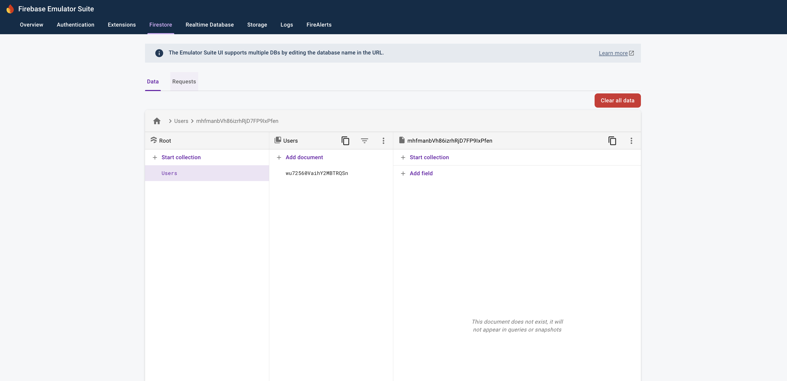
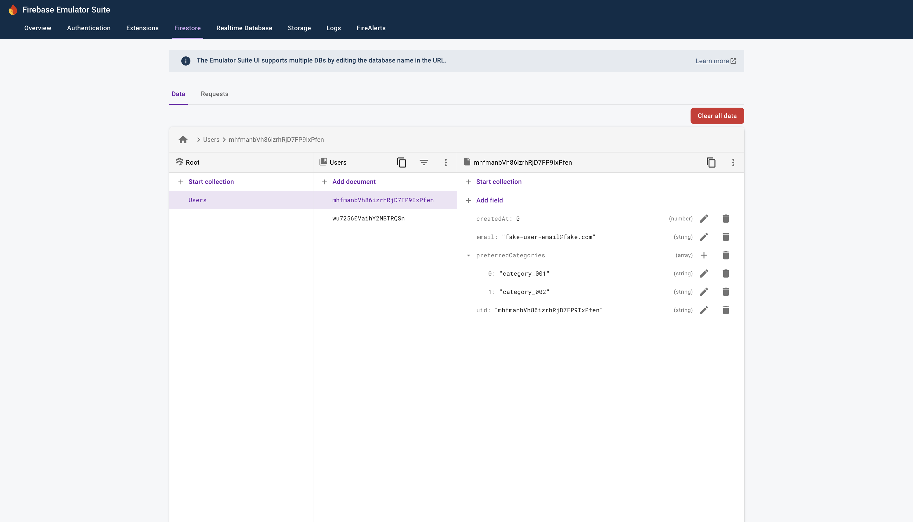

# Repro for issue 7613

A Web application that writes Firestore document to the Firebase emulator.

## Versions

firebase-tools: v13.16.0<br>
platform: macOS<br>
flutter:

```
Flutter 3.24.0 • channel stable • https://github.com/flutter/flutter.git
Framework • revision 80c2e84975 (5 weeks ago) • 2024-07-30 23:06:49 +0700
Engine • revision b8800d88be
Tools • Dart 3.5.0 • DevTools 2.37.2
```

## Steps to reproduce

1. Run `firebase emulators:start --only firestore --project demo-project`
2. Open a new terminal, run `cd test_app`
3. Run `flutter run -d chrome`
4. Open the app, click "Click Me", a document is created

   

5. Click "Click Me", a new document is created. Note: you might have to click it again since there are only 3 UIDs(33% chance it writes the same doc)

   
